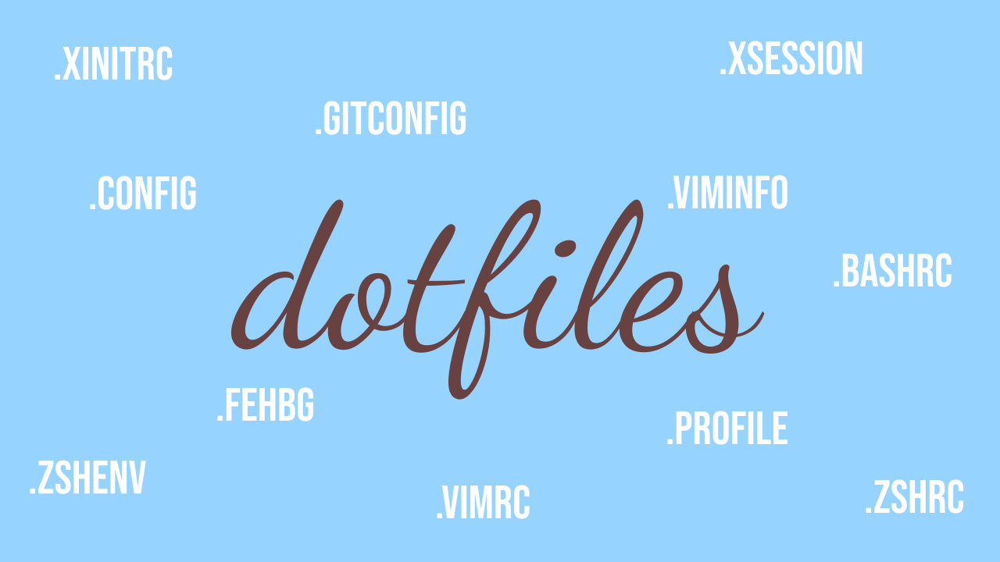

My Unix config files

## Table of content
- [Getting the repo](#getting-the-repo)
- [Removing the repo](#removing-the-repo)
- [Installing](#installing)
    - [Configuration files](#configuration-files)
    - [Dotfiles](#dotfiles)
    - [Manpages](#manpages)
    - [Packages](#packages)
        - [Manual](#manual)
        - [Automated](#automated)
- [`/bin` scripts](#bin-scripts)

## Getting the repo

```sh
git clone https://github.com/Adamocho/Dotfiles.git ~/.dotfiles
```

## Removing the repo

Delete the `.dotfiles` folder from the GUI or using the terminal

> NOTE:  
> Be careful with the `rm` command, as it can cause some serious damage

> NOTE 2:
> Make sure there are no symlinks to the ~/.dotfiles repository that you aren't aware of. Otherwise, after removing the repo, those symlinks will become **broken**, and thus won't be of any use.

```sh
rm -rf ~/.dotfiles
```

## Installing

The following section is split into segments according to what is needed. Most of the time there is an interactive script to install what one is in need of. 

Make sure those scripts are executable or run them via shell.
```sh
# Example of executing a file
~/.dotfiles/bootstrap/example_script.sh

# Example of running a script via shell
bash ~/.dotfiles/bootstrap/example_script.sh

# Chmod +x to make the script executable
chmod +x ~/.dotfiles/bootstrap/example_script.sh
```

### Configuration files

`./bootstrap/configure.sh`

It copies everything from `.dotfiles/etc/` into `~/.config/` dir in the user's home directory.

```sh
~/.dotfiles/bootstrap/configure.sh
```

### Dotfiles

`./bootstrap/install.sh`

It is a script for creating/updating symlinks from the repo to user's home directory.

> NOTE: Before overwriting a real file, it is backed up in `~/.config/dotfiles_backup` dir.

### Manpages

`./bootstrap/manpages.sh`

Copies manpages in `bootstrap/manpages/*` to `/usr/share/man`.

Read **manpages/REMINDER.md** for more info.

### Scripts

`./bootstrap/scripts.sh`

Copies the contents of `bin` to `~/.local/bin`.

### Packages

Split in two, according to the way of installing.

#### Manual

The list of packages with direct links is located in the **software/manual/** directory.

Its purpose is to be a list of software to install, located in one, easy to find, place.

Follow the links and from there install the packages manually.

#### Automated

`./bootstrap/packages.sh` is a little interactive script for managing packages.

The script will look for any files located inside **software/packages** directory. From there, it will prompt for each entry found, excluding blank lines and those starting with a comment (`#`).

As a result the `~/.config/packages_list.txt` file is created, which contains a list of chosen software.

```
coreutils
htop
plocate
tree
[...]
```

Now the last part is to pipe it to your package manager of choice. Examples below:

```sh
# To list available package managers
which apt apt-get pacman dnf yum brew homebrew emerge
```

> NOTE:
> The `-y` flag means "assume yes". In practice, it agrees on every prompt saving time.

apt
```sh
< ~/.config/packages_list.txt xargs sudo apt install -y
```

apt-get
```sh
< ~/.config/packages_list.txt xargs sudo apt-get install -y
```

pacman
```sh
< ~/.config/packages_list.txt xargs sudo pacman -S
```

dnf
```sh
< ~/.config/packages_list.txt xargs sudo dnf install -y
```

yum
```sh
< ~/.config/packages_list.txt xargs sudo yum install -y
```

brew
```sh
< ~/.config/packages_list.txt xargs brew install
```

homebrew
```sh
< ~/.config/packages_list.txt xargs homebrew install
```

emerge
```sh
< ~/.config/packages_list.txt xargs sudo emerge
```

## Bin scripts

This section contains is a quick description for each script/binary in the `dotfiles/bin` directory.

#### Git_templates.sh

Dmenu script used for getting the right **.gitignore** template for one's needs.

> NOTE: Templates come from github's gitignore repo: https://github.com/github/gitignore

> SECOND NOTE: The script can also be run in the terminal for more debug (e.g. wget output)

#### History.sh

A brief script that enables one to see the history in dmenu and copy it to the clippboard.

#### Kill.sh

Another concise dmenu script about killing a chosen process

> NOTE: It uses the `killall` command so it shall obliterate every process sharing the same name.

#### Manuals.sh

Yet another another dmenu script. It's purpose is to search a manpage or viewing a random one (for learning purposes). There is also the **Help** option for viewing the **man manpage** (which contains info about manpages structure, etc.).

> NOTE: Manpages open in the default terminal `x-terminal-emulator`
